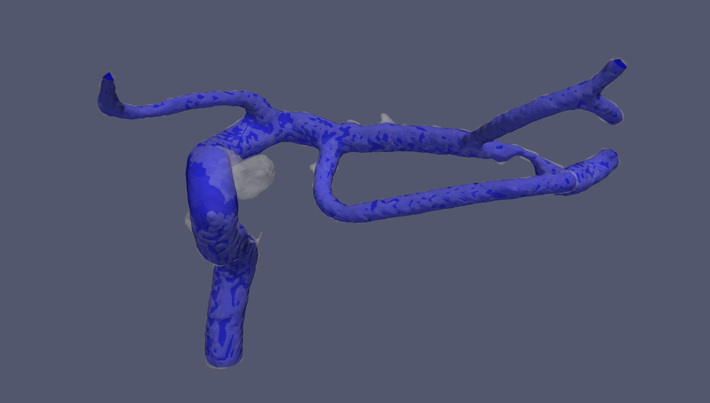
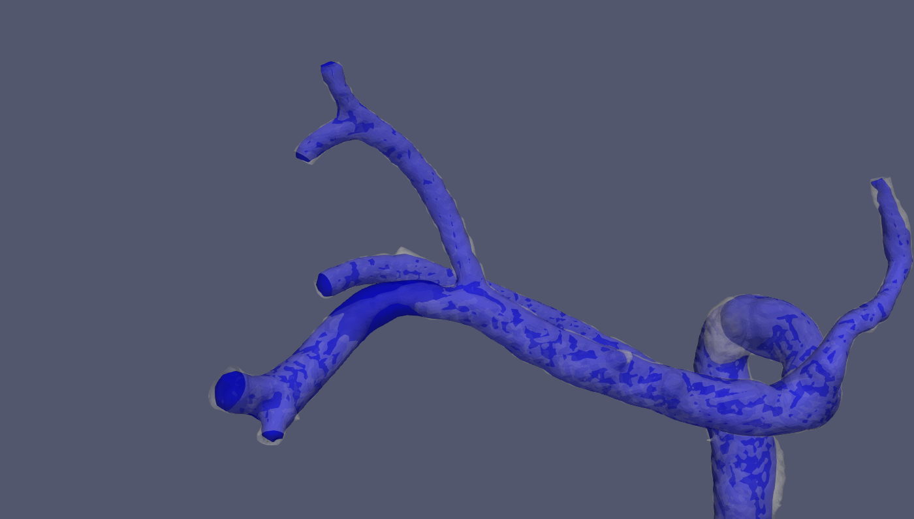
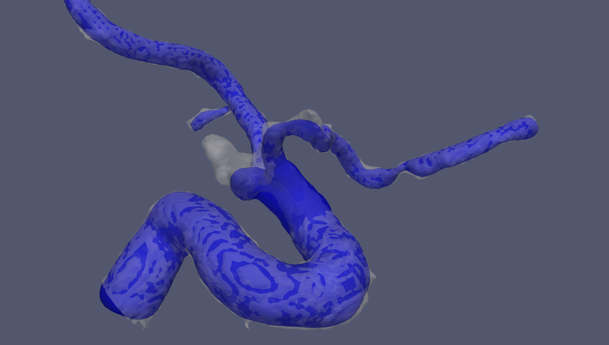
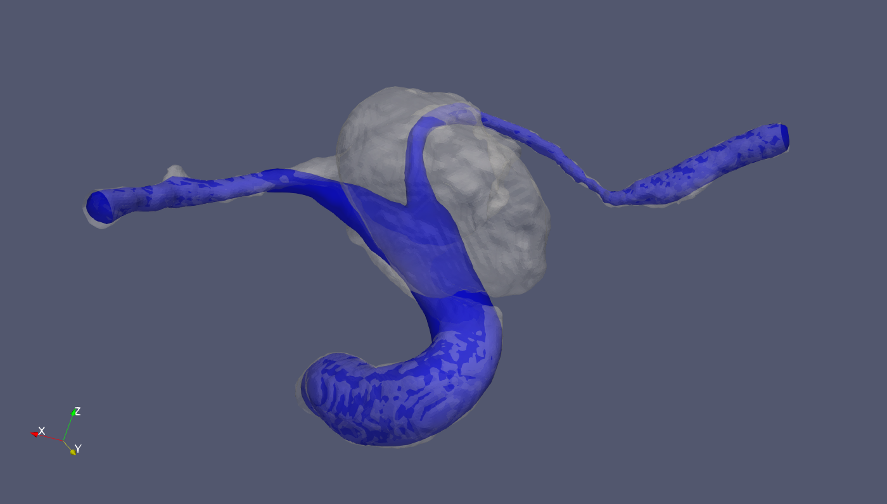

# Parent-Vessel-Reconstruction
An objective approach to digital removal of vascular aneurysms.

This is the C++ implementation of [VMTK PARENT VESSEL RECONSTRUCTION](http://www.vmtk.org/tutorials/ParentVesselReconstruction.html). The main objective of the software is to reconstruct parent vessel from aneurysm one. Detail theory can be found from [Ford's publication](https://www.birpublications.org/doi/epub/10.1259/bjr/67593727)

**Note: Clipping section now is identified manually with given clipping center and length for robustness**

## Usage
Example usage: `./Parent-Vessel-Reconstruction.exe <vessel-surface-path> <centerline-path> <output-directory>`

You should first follow https://github.com/jackyko1991/Vessel-Centerline-Extraction to compute centerline from vessel surface file.

When render window pop up, press `space` to locate the section for vessel reconstruction. Use `+` or `-` to change reconstruction zone size. You may need to adjust with `-d` to increase the threshold of including adjacent vessels at bifurcation points. Then press `Enter` to reconstruct parent vessels. 

In `output-directory` following files will be delivered if reconstruction is successful:

- centerline_interpolate.vtp (interpolated centerline for reconstruction purpose)
- centerline_patched.vtp (clipped centerline before interpolation)
- source_recon.vtp (reconstructed parent vessel)
- voronoi_clipped.vtp (clipped Voronoi diagram for interpolation input)
- voronoi_recon.vtp (Voronoi diagram used for parent vessel reconstruction)

**Note: centerline_interpolate.vtp does not provide sufficiently correct information of the reconstructed parent vessels. We recommend to recompute the centerline again for the output surface for exact geometry data.**

Use `-h` command to list detail usage:
```bash
$ ./Parent-Vessel-Reconstruction.exe -h
Reconstruct parent vessel from aneurysm vessels

Options:
  -?, -h, --help         Displays this help.
  -v, --version          Displays version information.
  -i                     Save intermediate files
  -s, --smooth <smooth>  Voronoi diagram smooth factor between 0 and 1
                         (default=0.6)
  -d, --distance <dist>  Distance between picked point and independent
                         centerline center of mass. (default=1.5)

Arguments:
  source          Source file to process.
  centerline      Centerline file to process.
  output          Output file location.
```

## Workflow
1. Compute forward centerline with user defined source and target points
2. Pick the section to clip
3. Clip centerline and corresponding Voronoi diagram
4. Smooth Vornoi diagram
4. Perform centerline and Voronoi diagram interpolation (we change to vtkPointInterpolator with adaptive Gaussian kernel instead of parallel transport method used by VMTK)
5. (Todo) End points extension
6. Reconstruct vessel surface

## Example Data
Sample dataset can be found from [./Data](./data). The provided sample data contain aneurysm and stenosis simultaneously. Corresponding centerlines are included in the same folder. 

- vessel1: lateral type aneurysm
- vessel2: bifurcation/terminus type aneurysm
- vessel3: bifurcation/terminus type aneurysm, you will need to increase `-d` option to above 6 for large terminus aneurysm case

## Results
White surface is the input, blue one is the reconstructed parent vessel.

### Lateral Aneurysm


### Stenosis


### Terminus Aneurysm



## References
- [Ford et al, An objective approach to digital removal of vasacular aneurysm: techniques and applications. BJR, 2009, ss55-61](https://www.birpublications.org/doi/epub/10.1259/bjr/67593727)
- [VMTK PARENT VESSEL RECONSTRUCTION](http://www.vmtk.org/tutorials/ParentVesselReconstruction.html)
